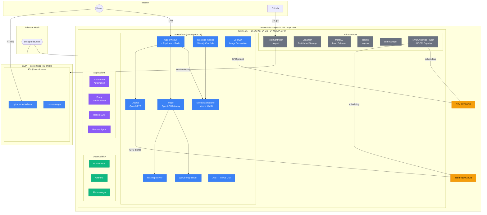
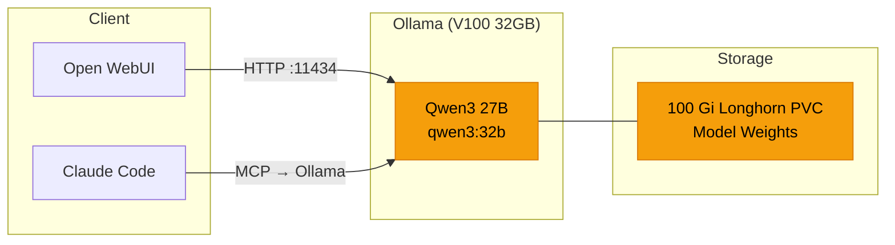
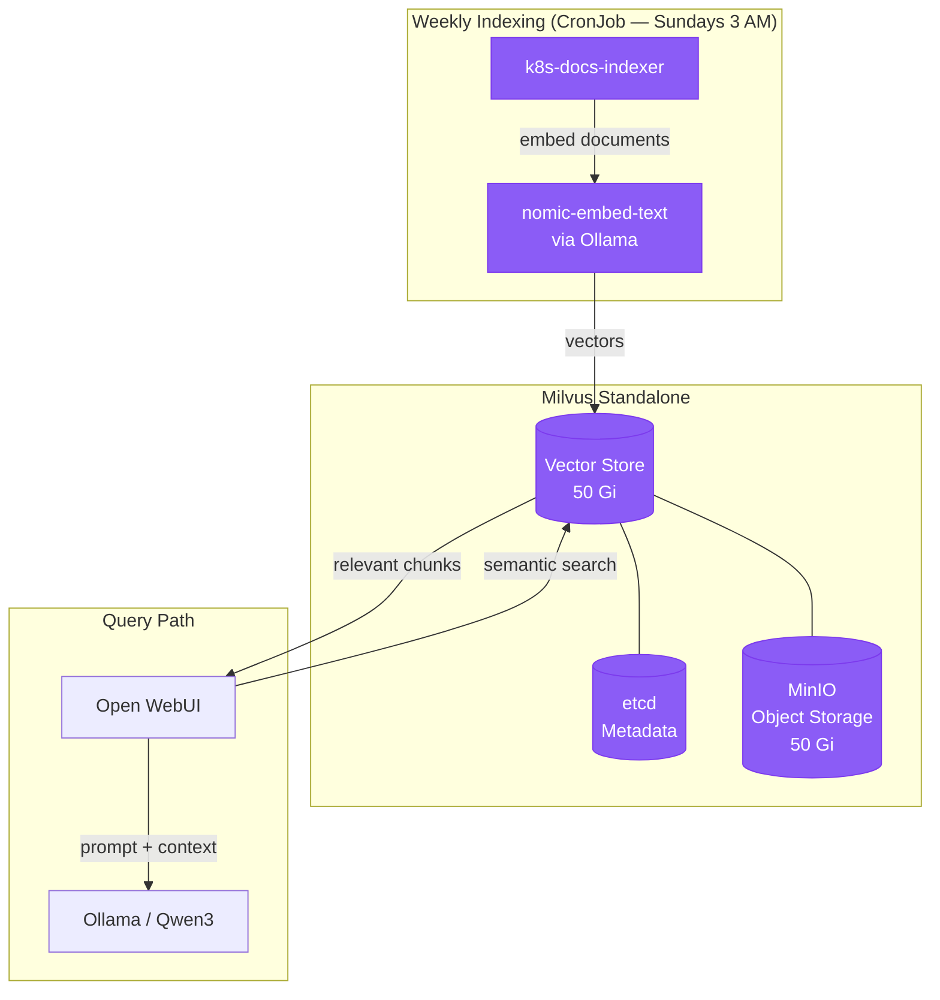
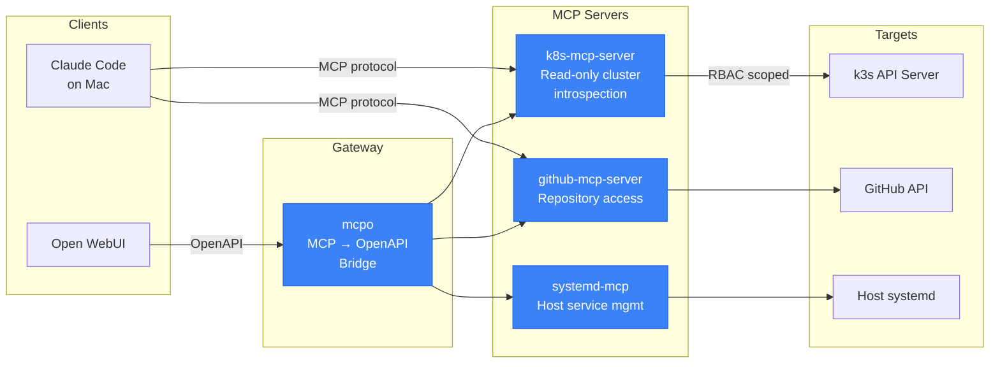
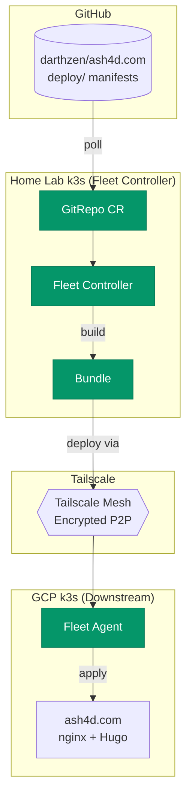

# ash4d.com — Private AI Platform & Multi-Cluster Kubernetes Infrastructure

A production-grade private AI platform running on a single-node k3s cluster, featuring local LLM inference (Qwen3 27B on a Tesla V100), RAG over a Milvus vector database, agentic MCP tooling, GPU-accelerated image generation, and full observability with Prometheus/Grafana. A second k3s cluster on GCP serves the public-facing site, managed as a downstream cluster via SUSE Fleet over a Tailscale mesh.

This repository documents the architecture, design decisions, and deployment patterns behind the platform.

## Architecture Overview



## Platform Specifications

| Resource | Details |
|---|---|
| **Node** | Single-node k3s (`sdf1`) on openSUSE Leap 16.0 |
| **Kernel** | 6.12.0-160000.33-default |
| **k3s Version** | v1.35.5+k3s1 |
| **CPU** | 16 vCPU |
| **Memory** | 64 GB |
| **GPU 0** | NVIDIA Tesla V100 32GB — LLM inference (Ollama/Qwen3) |
| **GPU 1** | NVIDIA GTX 1070 8GB — Image generation (ComfyUI) |
| **Container Runtime** | containerd 2.2.3-k3s1 |
| **Persistent Storage** | ~500 Gi across Longhorn volumes |
| **Running Pods** | 60+ across 12 namespaces |

## AI/ML Platform

The AI platform runs entirely in the `ai` namespace and provides three core capabilities: local LLM inference, retrieval-augmented generation (RAG), and agentic tool use via the Model Context Protocol (MCP).

### LLM Inference



**Ollama** serves Qwen3 27B (`qwen3:32b`) pinned to the Tesla V100 via NVIDIA device plugin GPU scheduling. The model weights live on a 100 Gi Longhorn persistent volume. The Ollama API is exposed on the LAN via MetalLB (`192.168.7.153:11434`), making it accessible to any device on the network.

**Open WebUI** provides the chat interface with Redis-backed sessions and a Pipelines sidecar for function execution. It connects directly to Ollama for inference and to Milvus for RAG-augmented responses.

### RAG Pipeline



A weekly Kubernetes CronJob (`k8s-docs-indexer`) incrementally indexes documents, embeds them using `nomic-embed-text` via Ollama, and stores the vectors in Milvus. The indexer maintains state in a 1 Gi PVC to track what's already been processed, avoiding redundant embeddings.

Milvus runs in standalone mode backed by etcd (metadata) and MinIO (object storage), with 50 Gi Longhorn volumes for both the vector store and object storage. **Attu** provides a web GUI for collection inspection and query testing, exposed on the LAN via MetalLB.

### Agentic MCP Tooling



The platform exposes cluster and development tools as MCP servers, enabling AI agents to take actions:

- **k8s-mcp-server** — Read-only Kubernetes introspection (pods, deployments, services, logs). RBAC-scoped to prevent mutations.
- **github-mcp-server** — Repository browsing, issue/PR access, code search against Rick's GitHub repositories.
- **systemd-mcp** — Host-level service management and introspection.

**mcpo** bridges these MCP servers into Open WebUI via an OpenAPI gateway, so Qwen3 can invoke Kubernetes queries, browse GitHub repos, and inspect host services as tool calls during a conversation — without granting the model write access to anything.

Claude Code on Rick's Mac connects to the MCP servers directly over the LAN, using the [`ollama-code-mcp`](https://github.com/darthzen/ollama-code-mcp) server to offload boilerplate generation, diff review, and batch refactors to the local Qwen3 instance instead of consuming cloud tokens.

### Image Generation

**ComfyUI** is available for Stable Diffusion workflows, pinned to the GTX 1070 to avoid contention with the V100 running Ollama. It has a 150 Gi Longhorn volume for models, outputs, and workflows. Currently scaled to zero when not in use.

## Infrastructure Layer

### Storage — Longhorn

All persistent data uses **Longhorn** distributed block storage with CSI integration. Longhorn provides snapshot, backup, and volume replication capabilities. Current allocation:

| Volume | Namespace | Size | Purpose |
|---|---|---|---|
| `ollama` | ai | 100 Gi | LLM model weights |
| `comfyui-data` | ai | 150 Gi | Diffusion models + outputs |
| `milvus` | ai | 50 Gi | Vector database |
| `milvus-minio` | ai | 50 Gi | Object storage (Milvus) |
| `glm-model-pvc` | ai | 50 Gi | Additional model storage (RWX) |
| `prometheus-db` | monitoring | 50 Gi | Metrics retention |
| `data-milvus-etcd-0` | ai | 10 Gi | Vector DB metadata |
| `open-webui` | ai | 10 Gi | Chat history + config |
| `grafana` | monitoring | 10 Gi | Dashboard state |
| `hermes-data` | hermes | 10 Gi | Agent state |
| Other volumes | various | 8 Gi | Node-RED, pipelines, indexer |
| **Total** | | **~498 Gi** | |

### Networking — MetalLB + Traefik

**MetalLB** provides bare-metal LoadBalancer services, assigning LAN IPs from a configured pool:

| IP | Service | Port |
|---|---|---|
| `192.168.7.150` | Traefik (Ingress) | 80, 443 |
| `192.168.7.151` | Open WebUI | 80 |
| `192.168.7.152` | Attu (Milvus GUI) | 80 |
| `192.168.7.153` | Ollama API | 11434 |
| `192.168.7.154` | ComfyUI | 80 |
| `192.168.7.155` | ComfyUI FileBrowser | 80 |
| `192.168.7.156` | Resilio Sync | 8888, 55555 |
| `192.168.7.157` | Emby | 8096, 8920 |
| `192.168.7.158` | Node-RED | 1880 |

**Traefik** handles ingress routing; **cert-manager** manages TLS certificates.

### GPU Management

The **NVIDIA Device Plugin** exposes both GPUs as schedulable resources (`nvidia.com/gpu: 2`). GPU affinity is controlled through resource requests in pod specs — Ollama requests the V100 (by UUID), ComfyUI requests the GTX 1070.

**DCGM Exporter** (DaemonSet) scrapes GPU telemetry (utilization, temperature, memory, power draw) and exposes it as Prometheus metrics, feeding into Grafana dashboards for real-time GPU monitoring.

## Multi-Cluster Management

### SUSE Fleet — GitOps at Scale



**SUSE Fleet** runs on the home cluster as both controller and local agent. The GCP cluster registers as a downstream cluster, with the Fleet agent connecting outbound to the controller over the Tailscale tunnel.

The deployment pipeline is fully GitOps:

1. Push site changes to `darthzen/ash4d.com` on GitHub
2. GitHub Actions builds the Hugo site and container image
3. Fleet detects the updated manifests in `deploy/`
4. Fleet bundles the changes and pushes them to the GCP downstream cluster
5. The site rolls with zero manual intervention

### Tailscale Mesh

Tailscale provides the connectivity layer between clusters — no VPN configuration, no port forwarding, no firewall holes. The GCP instance joins Rick's existing tailnet, and Fleet's agent communicates over the encrypted mesh. SSH access to the GCP instance also runs through Tailscale SSH.

## Observability

The full **Rancher Monitoring** stack provides production-grade observability:

- **Prometheus** — Metrics collection with 50 Gi retention, scraping all cluster components including GPU metrics via DCGM Exporter
- **Grafana** — Dashboards for cluster health, GPU utilization, pod resource consumption, and AI workload metrics
- **Alertmanager** — Alert routing and notification
- **kube-state-metrics** — Kubernetes object metrics
- **node-exporter** — Host-level system metrics
- **DCGM Exporter** — NVIDIA GPU telemetry (utilization, temperature, memory, power, ECC errors)

## Security Posture

- **MCP servers are read-only** — RBAC-scoped Kubernetes service accounts prevent AI agents from mutating cluster state
- **MCP tool whitelists** — Each MCP server exposes only the specific tools needed; no blanket access
- **Network segmentation** — Internal services (Milvus, etcd, MinIO, Redis) use ClusterIP with no external exposure
- **Longhorn encryption** — Storage volumes support at-rest encryption
- **Non-root containers** — Workloads run as non-root where supported
- **Tailscale ACLs** — Inter-cluster traffic is scoped to specific ports and tagged devices
- **cert-manager** — Automated TLS certificate lifecycle management
- **GPU isolation** — Dedicated GPU assignment prevents model inference from contending with image generation workloads

## Repository Structure

```
ash4d.com/
├── README.md                    # This document
├── docs/
│   ├── architecture.md          # Deep-dive architecture documentation
│   ├── ai-platform.md           # AI/ML platform details
│   ├── infrastructure.md        # Infrastructure layer documentation
│   └── deployment-plan.md       # GCP deployment plan
├── site/                        # Hugo source (future)
│   ├── config.toml
│   ├── content/
│   └── themes/
├── deploy/                      # Kubernetes manifests (Fleet-managed)
│   ├── namespace.yaml
│   ├── deployment.yaml
│   ├── service.yaml
│   ├── ingress.yaml
│   └── certificate.yaml
├── Dockerfile
└── .github/workflows/
    └── build-and-push.yaml
```

## Related Repositories

- [`ollama-code-mcp`](https://github.com/darthzen/ollama-code-mcp) — MCP server that delegates coding tasks from Claude Code to local Ollama/Qwen3, with file-aware tools and batch refactoring
- [`lab-fleet`](https://github.com/darthzen/lab-fleet) — Fleet GitRepo configurations for the home lab cluster
- [`k8s-demos`](https://github.com/darthzen/k8s-demos) — Kubernetes demonstration materials including NeuVector container security

## Tech Stack Summary

| Layer | Technology |
|---|---|
| **OS** | openSUSE Leap 16.0 |
| **Orchestration** | k3s v1.35 (home), k3s (GCP) |
| **Multi-Cluster** | SUSE Fleet (GitOps) |
| **LLM Inference** | Ollama + Qwen3 27B |
| **Vector Database** | Milvus (standalone) + etcd + MinIO |
| **Embeddings** | nomic-embed-text |
| **Chat Interface** | Open WebUI + Pipelines |
| **AI Tooling** | MCP (k8s, GitHub, systemd) via mcpo gateway |
| **Image Generation** | ComfyUI (Stable Diffusion) |
| **Automation** | Node-RED |
| **Storage** | Longhorn (CSI, ~500 Gi) |
| **Load Balancer** | MetalLB |
| **Ingress** | Traefik |
| **TLS** | cert-manager + Let's Encrypt |
| **GPU** | NVIDIA Tesla V100 32GB + GTX 1070 8GB |
| **GPU Monitoring** | DCGM Exporter |
| **Observability** | Prometheus + Grafana + Alertmanager |
| **Networking** | Tailscale mesh VPN |
| **Site Generator** | Hugo |
| **CI/CD** | GitHub Actions |

## About

Built by [Rick Ashford](https://www.linkedin.com/in/rickashford/) — Sales Engineering leader with 17 years at SUSE, specializing in Kubernetes, Linux, AI/LLM platforms, and open-source ecosystem strategy.
