# Infrastructure Layer

This document covers the Kubernetes infrastructure, storage, networking, GPU management, and observability stack running on the home lab k3s cluster.

## Cluster Overview

Single-node k3s cluster (`sdf1`) running on openSUSE Leap 16.0 with kernel 6.12.0. Despite being a single node, the cluster runs a full production-grade infrastructure stack — Longhorn distributed storage, MetalLB load balancing, Traefik ingress, cert-manager TLS, NVIDIA GPU scheduling, and Rancher monitoring.

### Namespace Layout

```mermaid
graph LR
    subgraph Namespaces
        AI[ai<br/>14 pods — AI/ML platform]
        MON[cattle-monitoring-system<br/>10 pods — Observability]
        CATTLE[cattle-system<br/>3 pods — Rancher/Fleet]
        FLEET[cattle-fleet-system<br/>1 pod — Fleet agent]
        CERT[cert-manager<br/>3 pods — TLS]
        KUBE[kube-system<br/>5 pods — Core k3s]
        LH[longhorn-system<br/>17 pods — Storage]
        MLB[metallb-system<br/>4 pods — Load balancing]
        NV[nvidia-device-plugin<br/>1 pod — GPU]
        NR[node-red<br/>1 pod — Automation]
        EMBY[emby<br/>1 pod — Media]
        RES[resilio<br/>1 pod — Sync]
        HERM[hermes<br/>1 pod — Agent]
    end

    style AI fill:#3b82f6,color:#fff
    style MON fill:#10b981,color:#fff
    style LH fill:#6b7280,color:#fff
```



## Storage — Longhorn

**Longhorn** provides enterprise-grade distributed block storage as a Kubernetes-native CSI driver. Components running:

- **longhorn-manager** (DaemonSet) — Volume lifecycle management
- **longhorn-ui** (2 replicas) — Web dashboard
- **longhorn-driver-deployer** — CSI driver installation
- **CSI sidecars** — attacher (3), provisioner (3), resizer (3), snapshotter (3)
- **engine-image** (DaemonSet) — Storage engine binaries
- **instance-manager** — Volume instance management

### Volume Allocation

Total provisioned storage: **~498 Gi** across 13 persistent volumes.

| Claim | Namespace | Size | Access | Purpose |
|---|---|---|---|---|
| ollama | ai | 100 Gi | RWO | LLM model weights |
| comfyui-data | ai | 150 Gi | RWO | Diffusion models + outputs |
| milvus | ai | 50 Gi | RWO | Vector database |
| milvus-minio | ai | 50 Gi | RWO | Object storage |
| glm-model-pvc | ai | 50 Gi | RWX | Shared model storage |
| prometheus-db | monitoring | 50 Gi | RWO | Metrics time series |
| data-milvus-etcd-0 | ai | 10 Gi | RWO | Milvus metadata |
| open-webui | ai | 10 Gi | RWO | Chat history + config |
| grafana | monitoring | 10 Gi | RWO | Dashboard definitions |
| hermes-data | hermes | 10 Gi | RWO | Agent state |
| node-red-data | node-red | 5 Gi | RWO | Flow definitions |
| open-webui-pipelines | ai | 2 Gi | RWO | Pipeline configs |
| k8s-docs-indexer-state | ai | 1 Gi | RWO | Indexer checkpoints |

The `glm-model-pvc` is notable as the only RWX (ReadWriteMany) volume, allowing multiple pods to share access to model files simultaneously.

## Networking — MetalLB + Traefik

### MetalLB

MetalLB provides bare-metal LoadBalancer service implementation using Layer 2 (ARP) or BGP advertisement. The cluster uses FRR (Free Range Routing) mode with the following components:

- **metallb-controller** — Assigns IPs from configured pool
- **metallb-speaker** (DaemonSet) — Advertises IPs via ARP/BGP
- **metallb-frr-k8s** (DaemonSet, 5 containers) — FRR routing daemon

IP allocation pool: `192.168.7.150–192.168.7.158` (9 IPs, 8 currently assigned).

### Traefik

Traefik serves as the cluster ingress controller, exposed via MetalLB on `192.168.7.150` (ports 80 and 443). Handles HTTP→HTTPS redirection and TLS termination for internal services.

## GPU Management

### NVIDIA Device Plugin

The **NVIDIA Device Plugin** (DaemonSet) exposes GPU resources to the Kubernetes scheduler:

```
nvidia.com/gpu: 2
```

Workloads request GPUs via standard resource limits, and the device plugin handles device assignment. GPU affinity (V100 vs. GTX 1070) is controlled through environment variables (`NVIDIA_VISIBLE_DEVICES`) set to specific GPU UUIDs in pod specs.

### DCGM Exporter

The **DCGM Exporter** (DaemonSet) collects GPU telemetry via the NVIDIA Data Center GPU Manager and exposes it as Prometheus metrics:

- GPU utilization (%)
- GPU memory usage (used/total)
- GPU temperature (°C)
- Power consumption (W)
- ECC error counts
- Clock speeds (SM, memory)

These metrics feed into Grafana dashboards for real-time GPU monitoring and capacity planning.

## Observability — Rancher Monitoring

The full Rancher Monitoring stack (based on kube-prometheus-stack) provides production-grade observability:

### Components

| Component | Type | Storage | Purpose |
|---|---|---|---|
| Prometheus | StatefulSet | 50 Gi | Metrics collection + storage |
| Grafana | Deployment | 10 Gi | Dashboards + visualization |
| Alertmanager | StatefulSet | — | Alert routing + notification |
| kube-state-metrics | Deployment | — | K8s object metrics |
| prometheus-node-exporter | DaemonSet | — | Host system metrics |
| prometheus-adapter | Deployment | — | Custom metrics API |
| monitoring-operator | Deployment | — | Stack lifecycle management |
| DCGM Exporter | DaemonSet | — | GPU metrics |
| pushprox (client + proxy) | DaemonSet + Deployment | — | Secure metrics proxying |

### Metrics Coverage

- **Cluster:** CPU, memory, disk, network per node/pod/container
- **Kubernetes:** Deployment health, pod restarts, PVC usage, API server latency
- **GPU:** Utilization, memory, temperature, power, ECC errors
- **Storage:** Longhorn volume health, IOPS, latency
- **Networking:** MetalLB pool usage, Traefik request rates

## Certificate Management

**cert-manager** (3 pods: controller, cainjector, webhook) handles automated TLS certificate lifecycle:

- Issues certificates from Let's Encrypt (or internal CA)
- Automatic renewal before expiry
- Stores certificates as Kubernetes Secrets
- Webhook validates Certificate and Issuer resources

## Fleet Agent

The **Fleet agent** connects this cluster to the Fleet controller for GitOps-based deployment management. See the [multi-cluster architecture](../README.md#multi-cluster-management) section for details on how Fleet manages both the home lab and the GCP downstream cluster.

## Other Workloads

| Workload | Namespace | Purpose | LAN IP |
|---|---|---|---|
| **Node-RED** | node-red | Visual automation/flow programming | 192.168.7.158:1880 |
| **Emby** | emby | Media server (video/music streaming) | 192.168.7.157:8096 |
| **Resilio Sync** | resilio | Peer-to-peer file synchronization | 192.168.7.156:8888 |
| **Hermes Agent** | hermes | Automation agent | — (ClusterIP) |
